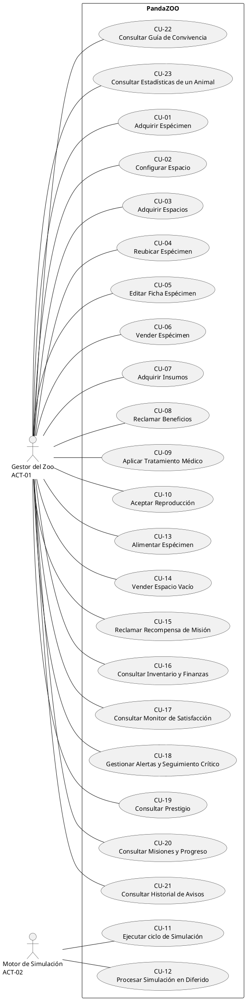

```plantuml
@startuml
left to right direction

actor "Gestor del Zoo\nACT-01" as ACT01
actor "Motor de Simulación\nACT-02" as ACT02

rectangle "PandaZOO" {
	usecase "CU-01\nAdquirir Espécimen" as CU01
	usecase "CU-02\nConfigurar Espacio" as CU02
	usecase "CU-03\nAdquirir Espacios" as CU03
	usecase "CU-04\nReubicar Espécimen" as CU04
	usecase "CU-05\nEditar Ficha Espécimen" as CU05
	usecase "CU-06\nVender Espécimen" as CU06
	usecase "CU-07\nAdquirir Insumos" as CU07
	usecase "CU-08\nReclamar Beneficios" as CU08
	usecase "CU-09\nAplicar Tratamiento Médico" as CU09
	usecase "CU-10\nAceptar Reproducción" as CU10
	usecase "CU-11\nEjecutar ciclo de Simulación" as CU11
	usecase "CU-12\nProcesar Simulación en Diferido" as CU12
	usecase "CU-13\nAlimentar Espécimen" as CU13
	usecase "CU-14\nVender Espacio Vacío" as CU14
	usecase "CU-15\nReclamar Recompensa de Misión" as CU15
	usecase "CU-16\nConsultar Inventario y Finanzas" as CU16
	usecase "CU-17\nConsultar Monitor de Satisfacción" as CU17
	usecase "CU-18\nGestionar Alertas y Seguimiento Crítico" as CU18
	usecase "CU-19\nConsultar Prestigio" as CU19
	usecase "CU-20\nConsultar Misiones y Progreso" as CU20
	usecase "CU-21\nConsultar Historial de Avisos" as CU21
	usecase "CU-22\nConsultar Guía de Convivencia" as CU22
	usecase "CU-23\nConsultar Estadísticas de un Animal" as CU23
}

ACT01 -- CU01
ACT01 -- CU02
ACT01 -- CU03
ACT01 -- CU04
ACT01 -- CU05
ACT01 -- CU06
ACT01 -- CU07
ACT01 -- CU08
ACT01 -- CU09
ACT01 -- CU10
ACT02 -- CU11
ACT02 -- CU12
ACT01 -- CU13
ACT01 -- CU14
ACT01 -- CU15
ACT01 -- CU16
ACT01 -- CU17
ACT01 -- CU18
ACT01 -- CU19
ACT01 -- CU20
ACT01 -- CU21
ACT01 -- CU22
ACT01 -- CU23
@enduml
```
